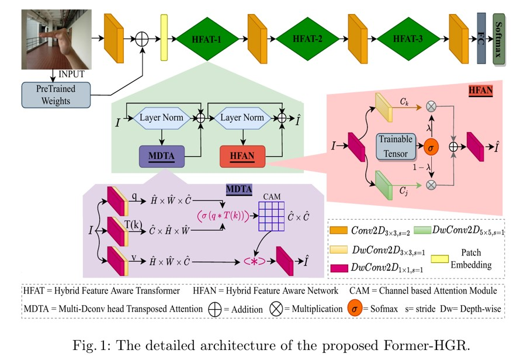

# Former-HGR: Hybrid Feature-Aware Transformer for Hand Gesture Recognition

This repository contains the official implementation of **Former-HGR**, a novel hybrid feature-aware transformer for hand gesture recognition (HGR). The work was published in [ICPR 2024](https://www.icpr.org/) and introduces a robust approach to improving the accuracy and efficiency of HGR systems, especially under challenging conditions like complex backgrounds and varying lighting.

## Overview

Former-HGR is designed to address the challenges faced by traditional HGR methods, such as:
- Illumination variations
- Complex backgrounds
- Diverse hand shapes
- Gesture class similarities

Key components:
1. **Multi-Dconv Head Transposed Attention (MDTA)**: Efficiently captures global context by computing attention across channels.
2. **Hybrid Feature-Aware Network (HFAN)**: Enriches the model with multi-scale features using adaptive fusion of convolutional kernels.

This model achieves state-of-the-art performance on multiple HGR benchmarks, including **NUSII**, **OUHANDS**, and **MUGD** datasets.

---

## Features
- **Global feature perception**: Employs MDTA for efficient attention.
- **Multi-scale feature learning**: Utilizes HFAN for adaptive feature extraction.
- **Person-independent validation**: Robust performance across diverse datasets.

---

## Benchmarks and Results

| Dataset       | Accuracy (%) | F1-Score |
|---------------|--------------|----------|
| **NUSII**     | 99.50        | 0.8350   |
| **OUHANDS**   | 96.10        | 0.9540   |
| **MUGD**      | 87.05        | 0.7450   |

---

## Requirements

To replicate the results, install the following dependencies:
- Python 3.8+
- PyTorch 1.10+
- CUDA 11.1
- Other libraries: `torchvision`, `numpy`, `matplotlib`, `scikit-learn`

Install the requirements via:
```bash
pip install -r requirements.txt
```

---

## Usage

### Dataset Preparation

Download the following datasets:
1. [NUSII Dataset](https://www.comp.nus.edu.sg/~nusii/)
2. [OUHANDS Dataset](https://ouhands.org/)
3. [MUGD Dataset](https://mugd-dataset.org/)

Place the datasets in the `data/` directory with the following structure:
```
data/
├── NUSII/
├── OUHANDS/
└── MUGD/
```

### Training

To train the model, run:
```bash
python train.py --dataset <dataset_name> --epochs 100 --batch_size 16
```

### Evaluation

Evaluate a trained model:
```bash
python evaluate.py --dataset <dataset_name> --checkpoint <path_to_model>
```

---

## Model Architecture

The Former-HGR architecture consists of:
- **Hybrid Feature-Aware Transformer (HFAT) blocks**
- **Multi-Dconv Head Transposed Attention (MDTA)**
- **Hybrid Feature-Aware Network (HFAN)**


